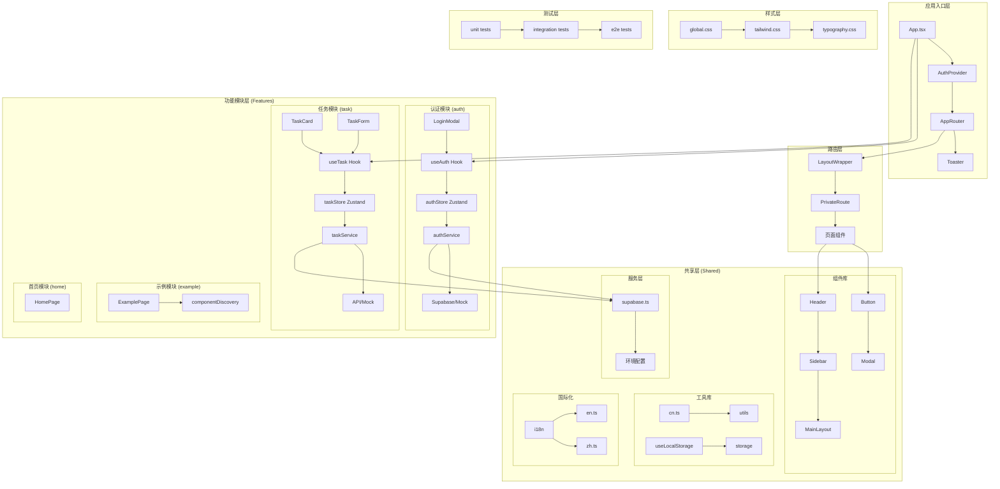
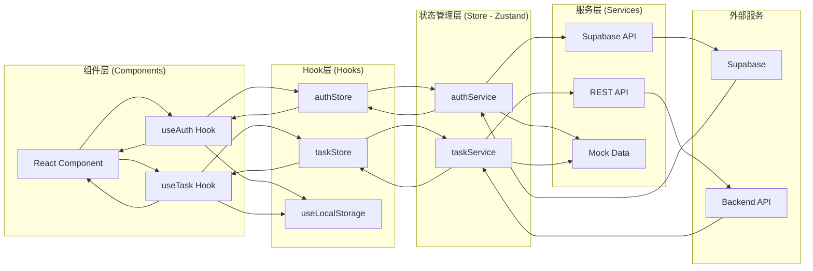
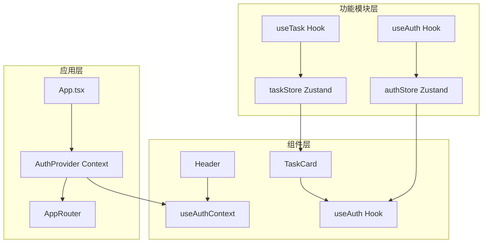
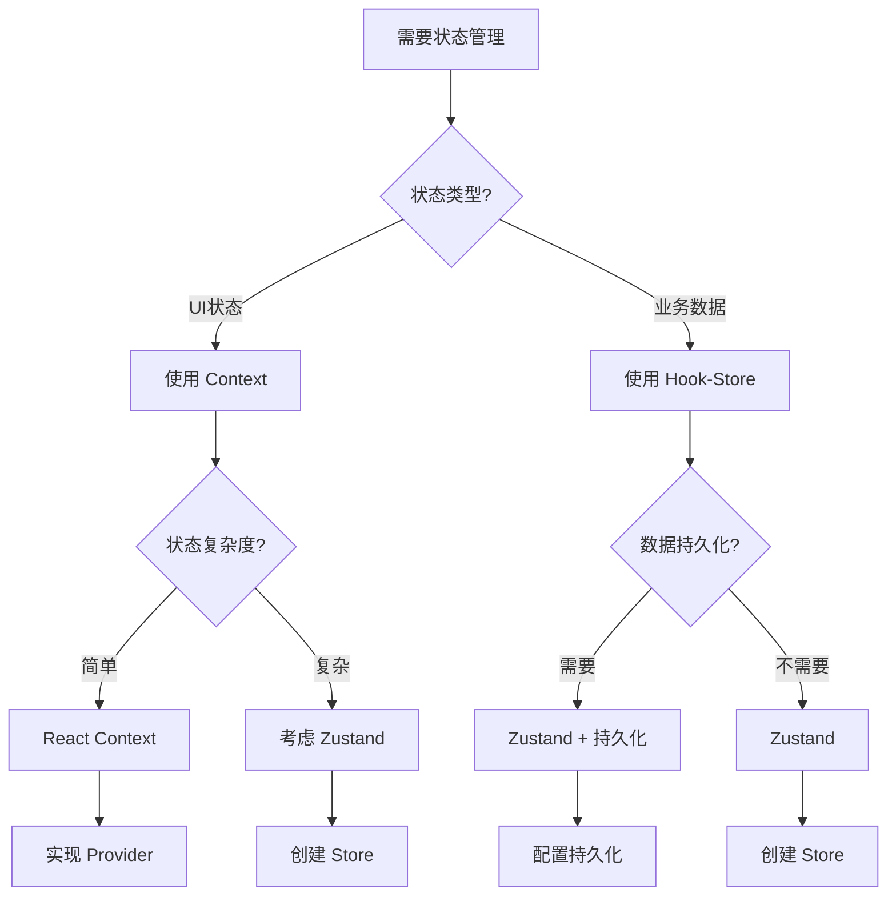

# AI-DevKit 项目架构文档

基于对您项目的深入分析，我为您创建了完整的架构文档。以下是项目的详细架构说明：

## 🚀 快速参考

### 状态管理选择指南
- **UI状态** (模态框、主题) → **Context**
- **业务状态** (用户数据、任务) → **Hook + Zustand Store**
- **本地状态** (表单、组件内部) → **useState**

### Provider 拆分原则
- **Context定义** → `AuthContext.ts` (只包含Context和Hook)
- **Provider组件** → `AuthProvider.tsx` (只包含Provider组件)
- **统一导出** → `index.ts` (便于管理导入)

### 文件组织最佳实践
```
src/app/providers/
├── AuthContext.ts     # Context定义和Hook
├── AuthProvider.tsx   # Provider组件
└── index.ts          # 统一导出
```

## 项目结构图 (Mermaid)



## 架构层次说明

### 1. 应用入口层
- **App.tsx**: 应用根组件，配置全局提供者和路由
- **AuthProvider**: 认证上下文提供者，管理登录模态框状态
- **AppRouter**: 路由配置和导航逻辑
- **Toaster**: 全局消息提示组件

### 2. 路由层
- **LayoutWrapper**: 布局包装器，提供统一的页面布局
- **PrivateRoute**: 私有路由组件，处理认证保护
- **页面组件**: 各个功能模块的页面组件

### 3. 功能模块层 (Features)
采用特性驱动开发 (Feature-Driven Development) 架构：

#### 认证模块 (auth)
```
auth/
├── components/     # UI组件
├── hooks/         # 业务逻辑Hook
├── services/      # API服务层
├── store/         # 状态管理
├── types/         # 类型定义
└── index.ts       # 模块导出
```

#### 任务模块 (task)
```
task/
├── components/    # 任务相关UI组件
├── hooks/         # 任务业务逻辑
├── services/      # 任务API服务
├── store/         # 任务状态管理
├── layout/        # 任务页面布局
├── pages/         # 任务页面组件
└── types/         # 任务类型定义
```

### 4. 共享层 (Shared)
- **组件库**: 可复用的UI组件
- **工具库**: 通用工具函数和Hook
- **国际化**: 多语言支持
- **服务层**: 外部服务集成

## Hook、Store、Service 关系架构



## 架构职责分工

### 1. Hook 层职责
- **业务逻辑封装**: 将复杂的业务逻辑封装成可复用的Hook
- **状态订阅**: 订阅Zustand store的状态变化
- **副作用管理**: 处理组件生命周期和副作用
- **数据转换**: 将store数据转换为组件需要的格式

### 2. Store (Zustand) 层职责
- **状态管理**: 集中管理应用状态
- **状态更新**: 提供状态更新方法
- **业务操作**: 封装业务操作逻辑
- **数据持久化**: 处理状态持久化

### 3. Service 层职责
- **API调用**: 封装外部API调用
- **数据转换**: 将API响应转换为应用需要的格式
- **错误处理**: 统一处理API错误
- **缓存管理**: 管理数据缓存策略

## Context 和 Provider 的作用

### 是否需要 Context 和 Provider？

**是的，需要！** 在您的项目中，Context和Provider主要用于以下场景：

### 1. AuthProvider 的作用
```typescript
// 职责：认证上下文管理
const AuthProvider = ({ children }) => {
  const [showSignInModal, setShowSignInModal] = useState(false);
  
  return (
    <AuthContext.Provider value={{ openSignInModal }}>
      {children}
      <LoginModal open={showSignInModal} onClose={closeSignInModal} />
    </AuthContext.Provider>
  );
};
```

**职责**:
- **全局状态共享**: 提供登录模态框的全局状态
- **跨组件通信**: 允许任何组件触发登录模态框
- **UI状态管理**: 管理模态框的显示/隐藏状态

### 2. Context vs Zustand 的选择

| 场景 | Context | Zustand |
|------|---------|---------|
| **全局UI状态** | ✅ 适合 | ❌ 过度设计 |
| **业务数据状态** | ❌ 性能问题 | ✅ 适合 |
| **组件间通信** | ✅ 简单场景 | ✅ 复杂场景 |
| **状态持久化** | ❌ 不支持 | ✅ 支持 |

### 3. 架构中的位置



## 状态管理架构设计原则

### 1. Context 用于全局 UI 状态

**适用场景：**
- 模态框显示/隐藏状态
- 主题切换 (深色/浅色模式)
- 侧边栏展开/收起状态
- 全局加载状态
- 通知消息状态

**设计原则：**
```typescript
// ✅ 正确的 Context 使用方式
const ThemeContext = createContext();

export const ThemeProvider = ({ children }) => {
  const [isDarkMode, setIsDarkMode] = useState(false);
  
  return (
    <ThemeContext.Provider value={{ isDarkMode, setIsDarkMode }}>
      {children}
    </ThemeContext.Provider>
  );
};

// 在组件中使用
const Header = () => {
  const { isDarkMode, setIsDarkMode } = useContext(ThemeContext);
  return (
    <button onClick={() => setIsDarkMode(!isDarkMode)}>
      切换主题
    </button>
  );
};
```

### 2. Hook-Store 用于全局业务状态

**适用场景：**
- 用户认证状态
- 任务列表数据
- 购物车数据
- 应用配置数据
- 缓存数据

**设计原则：**
```typescript
// ✅ 正确的 Hook-Store 使用方式
const useAuthStore = create((set) => ({
  user: null,
  isAuthenticated: false,
  login: (userData) => set({ user: userData, isAuthenticated: true }),
  logout: () => set({ user: null, isAuthenticated: false }),
}));

export function useAuth() {
  const { user, isAuthenticated, login, logout } = useAuthStore();
  
  // 添加副作用处理
  useEffect(() => {
    // 初始化逻辑
  }, []);
  
  return { user, isAuthenticated, login, logout };
}
```

### 3. 数据共享机制对比

| 特性 | Context | Hook-Store |
|------|---------|------------|
| **数据共享** | ✅ 可以共享 | ✅ 可以共享 |
| **性能影响** | 中等 (可能导致重渲染) | 低 (精确订阅) |
| **状态持久化** | ❌ 不支持 | ✅ 支持 |
| **开发工具** | 基础支持 | ✅ 完整支持 |
| **代码分割** | ❌ 困难 | ✅ 容易 |
| **测试友好** | 中等 | ✅ 优秀 |

### 4. 实际项目中的应用示例

#### Context 应用示例
```typescript
// 全局 UI 状态管理
const ModalContext = createContext();

export const ModalProvider = ({ children }) => {
  const [activeModals, setActiveModals] = useState(new Set());
  
  const openModal = (modalId) => {
    setActiveModals(prev => new Set([...prev, modalId]));
  };
  
  const closeModal = (modalId) => {
    setActiveModals(prev => {
      const newSet = new Set(prev);
      newSet.delete(modalId);
      return newSet;
    });
  };
  
  return (
    <ModalContext.Provider value={{ activeModals, openModal, closeModal }}>
      {children}
    </ModalContext.Provider>
  );
};
```

#### Hook-Store 应用示例
```typescript
// 全局业务状态管理
const useTaskStore = create((set, get) => ({
  tasks: [],
  isLoading: false,
  error: null,
  
  fetchTasks: async () => {
    set({ isLoading: true });
    try {
      const tasks = await taskService.getTasks();
      set({ tasks, isLoading: false, error: null });
    } catch (error) {
      set({ error: error.message, isLoading: false });
    }
  },
  
  addTask: async (taskData) => {
    const newTask = await taskService.createTask(taskData);
    set(state => ({ tasks: [...state.tasks, newTask] }));
  },
}));

export function useTask() {
  const { tasks, isLoading, error, fetchTasks, addTask } = useTaskStore();
  
  useEffect(() => {
    fetchTasks();
  }, []);
  
  return { tasks, isLoading, error, addTask };
}
```

### 5. 架构决策树



## 最佳实践建议

### 1. 状态管理策略

#### Context 使用原则
- **UI状态**: 使用Context (如模态框、主题切换、侧边栏状态)
- **简单状态**: 状态结构简单，不需要复杂操作
- **全局访问**: 需要在多个不相关组件间共享的状态
- **避免过度使用**: 不要用Context管理复杂业务数据

#### Hook-Store 使用原则
- **业务状态**: 使用Zustand (如用户数据、任务列表、购物车)
- **复杂状态**: 需要复杂操作和计算的状态
- **数据持久化**: 需要持久化到本地存储的状态
- **性能敏感**: 需要精确订阅和优化的状态

#### 本地状态使用原则
- **表单状态**: 使用本地state或React Hook Form
- **组件内部状态**: 只在单个组件内使用的状态
- **临时状态**: 不需要持久化的临时状态

### 2. 数据流设计

#### 单向数据流
```
组件 → Hook → Store → Service → API
  ↑                                    ↓
  ←────────── 数据响应 ────────────────←
```

#### Context 数据流
```
Provider → Context → Consumer Components
    ↑                                    ↓
    ←────────── 状态更新 ────────────────←
```

### 3. 模块化原则
- **高内聚**: 相关功能放在同一模块
- **低耦合**: 模块间通过接口通信
- **可复用**: Hook和组件设计为可复用
- **职责分离**: Context负责UI状态，Store负责业务状态

### 4. 性能优化
- **状态分割**: 避免全局状态过大，按功能模块分割
- **选择性订阅**: 组件只订阅需要的状态，避免不必要的重渲染
- **懒加载**: 按需加载模块和组件
- **状态缓存**: 合理使用缓存策略，避免重复请求

### 5. 代码组织最佳实践

#### Context 组织
```typescript
// ✅ 推荐：Context 和 Provider 放在同一目录，高内聚低耦合
src/
├── app/
│   ├── providers/
│   │   ├── AuthContext.ts        // 认证Context定义和Hook
│   │   ├── AuthProvider.tsx      // 认证Provider组件
│   │   ├── ThemeContext.ts       // 主题Context定义和Hook
│   │   ├── ThemeProvider.tsx     // 主题Provider组件
│   │   ├── ModalContext.ts       // 模态框Context定义和Hook
│   │   ├── ModalProvider.tsx     // 模态框Provider组件
│   │   └── index.ts              // 统一导出和组合Provider
```

**优势：**
- **高内聚性**: Context 和对应的 Provider 紧密相关
- **导入便利**: 从同一目录导入相关功能
- **维护简单**: 修改时不需要跨目录操作
- **符合习惯**: 符合 React 生态最佳实践

#### Store 组织
```typescript
// ✅ 推荐：按功能模块组织 Store
src/
├── features/
│   ├── auth/
│   │   ├── store/
│   │   │   └── authStore.ts      // 认证业务状态
│   │   └── hooks/
│   │       └── useAuth.ts        // 认证业务逻辑
│   ├── task/
│   │   ├── store/
│   │   │   └── taskStore.ts      // 任务业务状态
│   │   └── hooks/
│   │       └── useTask.ts        // 任务业务逻辑
```

### 6. 测试策略
- **Context 测试**: 测试Provider和Consumer的交互
- **Store 测试**: 测试状态更新和业务逻辑
- **Hook 测试**: 测试副作用和返回值
- **集成测试**: 测试完整的数据流

### 7. Provider 拆分最佳实践

#### 为什么需要拆分 Provider？

**问题：**
```typescript
// ❌ 不推荐：Provider 和 Hook 混合在一个文件中
// AuthProvider.tsx
const AuthContext = createContext();
export const useAuthContext = () => useContext(AuthContext);

export const AuthProvider = ({ children }) => {
  // Provider 实现
};
```

**问题分析：**
- 违反 React Fast Refresh 最佳实践
- 文件职责不清晰
- 难以测试和维护
- 可能导致热重载问题

#### 推荐的拆分方案

**1. Context 定义文件 (AuthContext.ts)**
```typescript
// ✅ 推荐：只包含 Context 定义和 Hook
import { createContext, useContext } from 'react';

interface AuthContextType {
  openSignInModal: () => void;
}

const AuthContext = createContext<AuthContextType>({
  openSignInModal: () => {},
});

export const useAuthContext = () => {
  const context = useContext(AuthContext);
  if (!context) {
    throw new Error('useAuthContext must be used within an AuthProvider');
  }
  return context;
};

export { AuthContext };
export type { AuthContextType };
```

**2. Provider 组件文件 (AuthProvider.tsx)**
```typescript
// ✅ 推荐：只包含 Provider 组件
import React, { useState, useCallback, ReactNode } from 'react';
import { AuthContext } from './AuthContext';
import { LoginModal } from '@/features/auth';

interface AuthProviderProps {
  children: ReactNode;
}

export const AuthProvider: React.FC<AuthProviderProps> = ({ children }) => {
  const [showSignInModal, setShowSignInModal] = useState(false);

  const openSignInModal = useCallback(() => setShowSignInModal(true), []);
  const closeSignInModal = useCallback(() => setShowSignInModal(false), []);

  return (
    <AuthContext.Provider value={{ openSignInModal }}>
      {children}
      <LoginModal open={showSignInModal} onClose={closeSignInModal} />
    </AuthContext.Provider>
  );
};
```

**3. 统一导出文件 (index.ts)**
```typescript
// ✅ 推荐：统一导出，便于管理
export { AuthProvider } from './AuthProvider';
export { useAuthContext } from './AuthContext';
export type { AuthContextType } from './AuthContext';
```

#### 拆分的好处

| 方面 | 拆分前 | 拆分后 |
|------|--------|--------|
| **职责分离** | ❌ 混合职责 | ✅ 单一职责 |
| **Fast Refresh** | ❌ 可能有问题 | ✅ 完全支持 |
| **可测试性** | 中等 | ✅ 优秀 |
| **可维护性** | 中等 | ✅ 优秀 |
| **代码复用** | 困难 | ✅ 容易 |

#### 实际项目中的应用

```typescript
// 使用方式保持不变
import { useAuthContext } from '@/app/providers';

const MyComponent = () => {
  const { openSignInModal } = useAuthContext();
  return <button onClick={openSignInModal}>登录</button>;
};
```

### 8. Context 组织最佳实践

#### Context 和 Provider 应该放在一起吗？

**推荐：放在同一目录下**

**理由：**
1. **高内聚性**: Context 定义和 Provider 实现紧密相关
2. **维护便利**: 修改时不需要跨目录操作
3. **导入清晰**: 从同一目录导入相关功能
4. **符合习惯**: 符合 React 生态最佳实践

#### 完整的组织方案

**目录结构：**
```
src/app/providers/
├── AuthContext.ts        # 认证Context定义和Hook
├── AuthProvider.tsx      # 认证Provider组件
├── ThemeContext.ts       # 主题Context定义和Hook
├── ThemeProvider.tsx     # 主题Provider组件
├── ModalContext.ts       # 模态框Context定义和Hook
├── ModalProvider.tsx     # 模态框Provider组件
└── index.ts              # 统一导出和组合Provider
```

**使用方式：**
```typescript
// 1. 单独使用
import { AuthProvider, useAuthContext } from '@/app/providers';

// 2. 组合使用
import { AppProviders } from '@/app/providers';

// 在 App.tsx 中
const App = () => {
  return (
    <AppProviders>
      <AppRouter />
    </AppProviders>
  );
};
```

#### 为什么不推荐分离？

**分离的问题：**
```typescript
// ❌ 不推荐：Context 和 Provider 分离
src/
├── contexts/           # Context 定义
│   ├── AuthContext.ts
│   └── ThemeContext.ts
├── providers/          # Provider 组件
│   ├── AuthProvider.tsx
│   └── ThemeProvider.tsx
```

**问题分析：**
- **职责分散**: 相关功能分散在不同目录
- **维护复杂**: 修改时需要跨目录操作
- **导入混乱**: 需要从多个目录导入
- **理解困难**: 增加代码理解成本

#### 最佳实践总结

| 方面 | 推荐方案 | 不推荐方案 |
|------|----------|------------|
| **组织方式** | Context + Provider 同目录 | Context 和 Provider 分离 |
| **导入方式** | 统一从 providers 导入 | 从多个目录导入 |
| **维护性** | ✅ 简单 | ❌ 复杂 |
| **可读性** | ✅ 清晰 | ❌ 混乱 |

## 项目文件结构详解

```
AI-DevKit/
├── docs/                          # 文档目录
│   ├── prompts/                   # 提示词模板
│   ├── README.md                  # 项目说明
│   └── 产品说明文档.md            # 产品文档
├── docs-site/                     # 文档站点
│   ├── guide/                     # 指南文档
│   ├── prompts/                   # 提示词文档
│   └── scripts/                   # 文档同步脚本
├── src/                           # 源代码
│   ├── app/                       # 应用核心
│   │   ├── pages/                 # 错误页面
│   │   ├── providers/             # 全局提供者
│   │   │   ├── AuthContext.ts     # 认证Context定义
│   │   │   ├── AuthProvider.tsx   # 认证Provider组件
│   │   │   └── index.ts           # 统一导出
│   │   ├── router/                # 路由配置
│   │   └── store/                 # 全局状态
│   ├── features/                  # 功能模块
│   │   ├── auth/                  # 认证模块
│   │   ├── task/                  # 任务模块
│   │   ├── example/               # 示例模块
│   │   └── home/                  # 首页模块
│   ├── shared/                    # 共享资源
│   │   ├── components/            # 共享组件
│   │   ├── hooks/                 # 共享Hook
│   │   ├── services/              # 共享服务
│   │   ├── utils/                 # 工具函数
│   │   └── i18n/                  # 国际化
│   ├── styles/                    # 样式文件
│   ├── tests/                     # 测试文件
│   └── mock/                      # 模拟数据
├── public/                        # 静态资源
└── scripts/                       # 构建脚本
```

## 技术栈说明

### 前端框架
- **React 18**: 主框架
- **TypeScript**: 类型安全
- **Vite**: 构建工具

### 状态管理
- **Zustand**: 轻量级状态管理
- **React Context**: 全局UI状态

### UI组件
- **Tailwind CSS**: 样式框架
- **Heroicons**: 图标库
- **Sonner**: 消息提示

### 路由
- **React Router**: 客户端路由

### 后端服务
- **Supabase**: 后端即服务
- **Mock Data**: 开发阶段模拟数据

### 测试
- **Jest**: 单元测试
- **React Testing Library**: 组件测试

这个架构设计遵循了现代React应用的最佳实践，具有良好的可维护性、可扩展性和性能表现。
