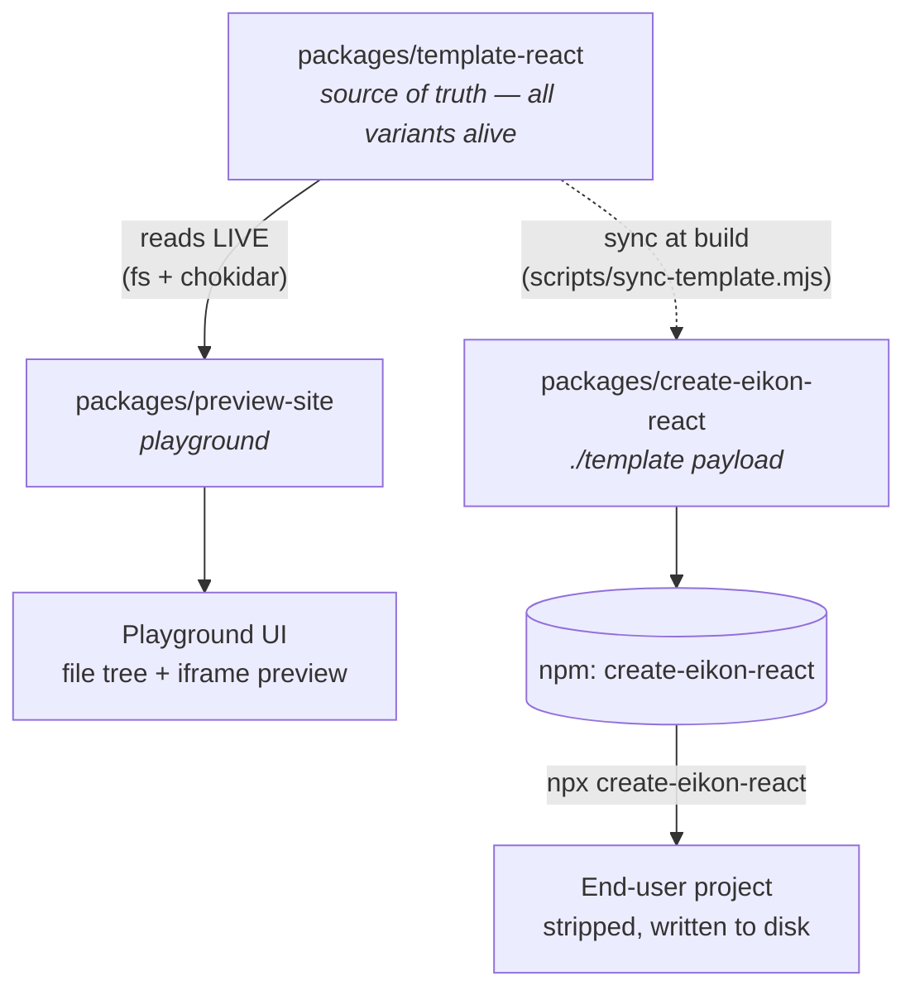

# Eikon for React

> An AI-Coding-Agent-friendly React starter — `npx create-eikon-react` + a curated React 19 template, plus a portable `.agent/` protocol any agent (Cursor, Claude Code, Codex, …) can read.
>
> _Eikon_ (Ancient Greek **εἰκών**, "image / rendered form") — the word English `icon` came from. A React app, after all, is the eikon of its state.

[](./LICENSE)
[](https://react.dev)
[](https://tailwindcss.com)
[](https://vitejs.dev)

## What this is

One source template plus two things that consume it — **three packages in a single pnpm workspace**:

| Package | Role |
| --- | --- |
| [`packages/template-react`](packages/template-react) | **Source of truth.** The canonical React 19 app, with `@eikon:variant(...)` / `@eikon:feature(...)` strip markers around every optional axis. Workspace-developable on its own (`pnpm dev`); all variants live simultaneously and tests pass with everything on. |
| [`packages/create-eikon-react`](packages/create-eikon-react) | **Distribution.** The CLI published to npm as `create-eikon-react`. At build time `scripts/sync-template.mjs` mirrors `template-react/` into the package's own `./template/` payload and `tsup` bundles the binary. At end-user runtime the CLI strips that bundled payload according to the user's choices and writes the result to disk. |
| [`packages/preview-site`](packages/preview-site) (`@eikon/preview`) | **Try-before-scaffold playground.** Reads `template-react/` *live* (a chokidar watcher invalidates the cache when source changes), applies the same strip engine on demand, and surfaces it as a side-by-side "what file tree would I get?" + "what would the running app look like?" UI. Does not ship anything to end users. |

The template is **opinionated, AI-agent-aware, and feature-first** so that — humans or AI agents — anyone who edits a generated project starts from the same conventions instead of reinventing them.

## Architecture



The strip engine — the line-level `@eikon:variant` / `@eikon:feature` block remover — is the one piece of logic shared across all three packages. `template-react` defines the markers, `create-eikon-react` runs them on the user's machine, `preview-site` runs them on demand to render the playground.

### Why each package is necessary

- **`template-react` exists** so the React app, its variants, and its test suite live in one place. The CLI's `./template/` payload is *generated* from this directory at build time, never edited by hand.
- **`create-eikon-react` exists** so end users can scaffold offline, with a single npm install, without depending on the playground server. Stripping happens on the user's machine; the bundled payload is the authoritative thing they get.
- **`preview-site` exists** so users can pick a parameter combo with confidence before running the CLI. It collapses the "scaffold → install → run" feedback loop into a single page. It's a UX layer on top of the same strip engine — not a second source of truth.

### Why there's no per-permutation matrix CI

The question naturally arises: with axes like `platform × supabase × pm × design × ui × layout × toastPosition`, shouldn't CI run all 4000+ combinations through `strip → vite build`? No, because three independent guard rails already cover that surface:

1. **`template-react`'s own test suite runs with every variant alive** — a strictly stronger condition than any single stripped subset. If a variant's import or dispatch entry would break a stripped build, it breaks the workspace test suite first.
2. **The strip engine itself is unit-tested** in both `create-eikon-react` (block pairing, marker syntax, file-level removal) and `preview-site` (`__tests__/strip-drift.test.ts` checks the simulator's output against the real CLI strip).
3. **`pnpm e2e` runs the full chain on representative scenarios** — `npm pack` the CLI, install the tarball into a throwaway sandbox, scaffold a project, then `pnpm install && pnpm typecheck && pnpm test && pnpm lint && pnpm build` *inside* the generated project. That's the smoke test for the strip → distribute → run pipeline.

A 4032-cell matrix on top of those three would catch nothing they don't, while burning CI minutes proportional to the cross-product of every axis.

## Quick start (consumers)

```bash
npx create-eikon-react my-app
# or
pnpm create eikon-react my-app
```

The CLI is interactive and will ask:

- Project name (positional arg lets you skip the prompt)
- **Platform target** — `web` (browser, default), `desktop` (Tauri 2 shell), or `mobile` (Capacitor shell)
- Whether to include **Supabase** (auth + db + storage scaffolding)
- Package manager (pnpm / npm / bun)
- Install deps and `git init` now or later

TanStack Query ships as baseline infrastructure in every scaffold (alongside
React Router), so there's no question about it — the `QueryClientProvider`
is wired in `src/app/providers.tsx` out of the box.

Non-interactive flags exist for CI scripting:

```bash
npx create-eikon-react my-app \
  --yes \
  --platform desktop \
  --no-supabase \
  --pm pnpm \
  --no-install --no-git
```

Picking `--platform desktop` adds an `apps/desktop/` Tauri 2 shell next to
your web bundle; `--platform mobile` adds an `apps/mobile/` Capacitor 6
shell. See [docs/platform-targets.md](docs/platform-targets.md) for the
trade-offs and prerequisites.

## What you get in a generated project

- **Platform target** — pick `web` (default), `desktop` (Tauri 2 shell under `apps/desktop/`), or `mobile` (Capacitor 6 shell under `apps/mobile/`); the same React app powers all three. See [docs/platform-targets.md](docs/platform-targets.md).
- **React 19** + **TypeScript 5.6+**
- **Vite 6** + **Tailwind CSS v4** (CSS-first config, no `tailwind.config.js`)
- **animate-ui style** primitives in `src/shared/ui/` (`motion` + Radix)
- **Feature-first architecture** with ESLint-enforced import boundaries
- **Vitest** + **Testing Library** with `__tests__/` colocated per feature
- **React Router v7**, **Zustand**, **React Hook Form** + **zod**, **i18next** (en/zh)
- **TanStack Query** for server-state — baseline, wired by default
- Optional **Supabase** (`@supabase/supabase-js`)
- **`.agent/` protocol** — rules and skills any AI coding agent can read directly:

  ```
  .agent/
  ├── README.md
  ├── rules/                 # hard constraints: architecture, React, Tailwind v4, …
  └── skills/                # task playbooks: add-feature, add-page, write-test, …
  ```

  See [docs/agent-protocol.md](docs/agent-protocol.md) for the full specification.

## Repository layout

```
.
├── packages/
│   ├── template-react/      # Source of truth — React 19 template with strip markers
│   ├── create-eikon-react/  # CLI: bundles a snapshot of template-react, strips on user's machine
│   └── preview-site/        # Playground: reads template-react live, runs strip + Vite per request
├── docs/
│   ├── architecture.md      # Why feature-first, how boundaries work
│   └── agent-protocol.md    # The .agent/ specification
├── package.json             # Workspace root
└── pnpm-workspace.yaml
```

## Development (contributors)

Requires Node ≥ 20.10 and pnpm ≥ 9.

```bash
pnpm install                                  # install all workspaces
pnpm --filter @eikon/react dev                # run the template standalone
pnpm --filter @eikon/react test               # template tests (all variants alive)
pnpm --filter @eikon/react lint               # template lint
pnpm --filter @eikon/react build              # template prod build
pnpm --filter create-eikon-react build        # build CLI bundle + sync template payload
pnpm --filter @eikon/preview dev              # run the playground (reads template-react live)
pnpm --filter @eikon/preview test             # strip-drift + simulator tests
pnpm cli                                      # build CLI then run from source
```

### End-to-end validation

The CLI ships with a self-contained e2e suite that simulates the real `npx`
install path:

1. Builds the CLI bundle and syncs the template payload.
2. Runs `npm pack` to produce the exact tarball that `npm publish` would.
3. Installs the tarball into a throwaway sandbox so the binary is invoked the
   same way `npx` would invoke it after a registry pull.
4. Scaffolds each configured scenario — `default`, `full` (Supabase on),
   `desktop` (Tauri shell), `mobile` (Capacitor shell), `variants` (custom UI
   axis variants), `variants-shadcn`, `variants-animate-ui`, `pm-npm`,
   `pm-bun` — and verifies its file tree, `package.json` deps, and the
   contents of `src/app/providers.tsx` after feature stripping.
5. Without `--quick`, also runs `pnpm install && pnpm typecheck && pnpm test && pnpm lint && pnpm build`
   inside each generated project.

```bash
pnpm e2e:quick                       # ~20s, no install/build — just scaffolding
pnpm e2e                             # ~2-5 min, full pipeline inside each scenario
pnpm e2e -- --only default           # run a single named scenario
pnpm e2e -- --keep                   # keep the temp workspace on disk for inspection
```

The e2e runner lives at [packages/create-eikon-react/scripts/e2e.mjs](packages/create-eikon-react/scripts/e2e.mjs).

Releasing the CLI (manual for now):

```bash
pnpm --filter create-eikon-react build
cd packages/create-eikon-react && npm publish --access public
```

## Documentation

- [docs/architecture.md](docs/architecture.md) — Feature-first design rationale + import boundary enforcement.
- [docs/agent-protocol.md](docs/agent-protocol.md) — `.agent/rules` and `.agent/skills` schema and authoring guide.
- [docs/platform-targets.md](docs/platform-targets.md) — Web / Desktop (Tauri 2) / Mobile (Capacitor) target selection, prerequisites, and how the same React app powers all three.
- [packages/template-react/.agent/README.md](packages/template-react/.agent/README.md) — Live `.agent/` README inside the template.

## License

MIT
