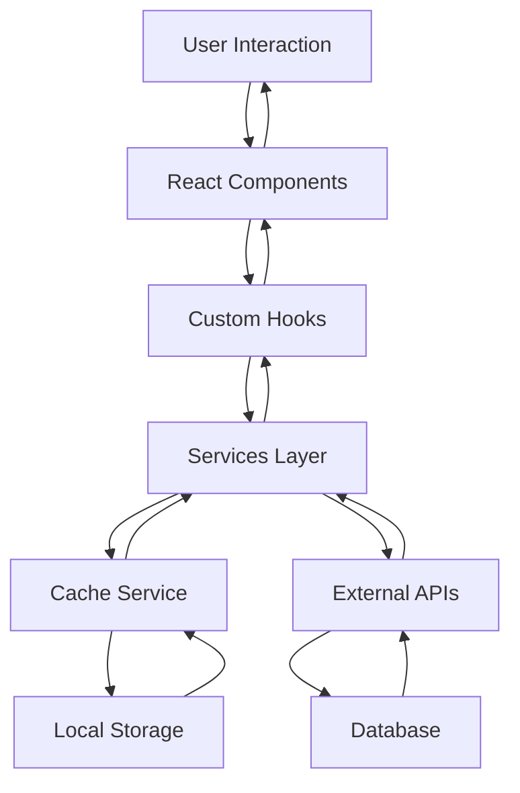

# 系统架构

> 🏗️ **AI-DevKit 系统架构设计** - 现代化的 AI 应用开发框架架构

## 📋 目录

- [架构概览](#架构概览)
- [核心模块](#核心模块)
- [技术栈](#技术栈)
- [设计原则](#设计原则)
- [性能优化](#性能优化)

---

## 架构概览

### 🎯 整体架构

AI-DevKit 采用现代化的分层架构设计，确保系统的可扩展性、可维护性和高性能。

```
┌─────────────────────────────────────────────────────────────┐
│                        Presentation Layer                    │
│  ┌─────────────┐  ┌─────────────┐  ┌─────────────┐          │
│  │   React     │  │   Router    │  │   UI/UX     │          │
│  │ Components  │  │  Management │  │  Components │          │
│  └─────────────┘  └─────────────┘  └─────────────┘          │
└─────────────────────────────────────────────────────────────┘
┌─────────────────────────────────────────────────────────────┐
│                      Business Logic Layer                    │
│  ┌─────────────┐  ┌─────────────┐  ┌─────────────┐          │
│  │   Hooks     │  │   Services  │  │   Utils     │          │
│  │  & State    │  │  & API      │  │  & Helpers  │          │
│  └─────────────┘  └─────────────┘  └─────────────┘          │
└─────────────────────────────────────────────────────────────┘
┌─────────────────────────────────────────────────────────────┐
│                        Data Layer                           │
│  ┌─────────────┐  ┌─────────────┐  ┌─────────────┐          │
│  │   Cache     │  │   Database  │  │   External  │          │
│  │  Service    │  │  & Storage  │  │    APIs     │          │
│  └─────────────┘  └─────────────┘  └─────────────┘          │
└─────────────────────────────────────────────────────────────┘
```

### 🔄 数据流



---

## 核心模块

### 1. 🎨 表现层 (Presentation Layer)

#### React 组件架构

```tsx
// 组件分层结构
src/
├── shared/
│   ├── components/          # 通用组件
│   │   ├── Button/
│   │   ├── Modal/
│   │   ├── Toast/
│   │   └── Layout/
│   └── hooks/              # 通用 Hooks
├── features/               # 功能模块
│   ├── auth/
│   │   ├── components/
│   │   ├── hooks/
│   │   └── services/
│   └── task/
│       ├── components/
│       ├── hooks/
│       └── services/
└── app/                    # 应用层
    ├── providers/
    ├── router/
    └── store/
```

#### 组件设计原则

```tsx
// ✅ 好的组件设计
interface ComponentProps {
  // 1. 明确的 props 类型
  data: DataType;
  onAction: (id: string) => void;
  
  // 2. 可选的配置项
  config?: ComponentConfig;
  
  // 3. 默认值处理
  className?: string;
}

// 4. 组件职责单一
const TaskList = ({ tasks, onTaskClick, config }: TaskListProps) => {
  // 只负责渲染任务列表
  return (
    <div className="task-list">
      {tasks.map(task => (
        <TaskItem 
          key={task.id} 
          task={task} 
          onClick={onTaskClick}
        />
      ))}
    </div>
  );
};
```

### 2. 🧠 业务逻辑层 (Business Logic Layer)

#### 状态管理架构

```tsx
// Zustand 状态管理
interface AppState {
  // 用户状态
  user: User | null;
  isAuthenticated: boolean;
  
  // 应用状态
  theme: 'light' | 'dark';
  language: string;
  
  // 功能状态
  tasks: Task[];
  loading: boolean;
  
  // 操作方法
  actions: {
    login: (credentials: LoginCredentials) => Promise<void>;
    logout: () => void;
    addTask: (task: Task) => void;
    updateTask: (id: string, updates: Partial<Task>) => void;
  };
}

// 创建 store
const useAppStore = create<AppState>((set, get) => ({
  // 初始状态
  user: null,
  isAuthenticated: false,
  theme: 'light',
  language: 'zh-CN',
  tasks: [],
  loading: false,
  
  // 操作方法
  actions: {
    login: async (credentials) => {
      set({ loading: true });
      try {
        const user = await authService.login(credentials);
        set({ user, isAuthenticated: true, loading: false });
      } catch (error) {
        set({ loading: false });
        throw error;
      }
    },
    
    logout: () => {
      set({ user: null, isAuthenticated: false });
    },
    
    addTask: (task) => {
      const { tasks } = get();
      set({ tasks: [...tasks, task] });
    },
    
    updateTask: (id, updates) => {
      const { tasks } = get();
      set({
        tasks: tasks.map(task => 
          task.id === id ? { ...task, ...updates } : task
        )
      });
    }
  }
}));
```

#### 服务层设计

```tsx
// 服务层架构
class ApiService {
  private baseURL: string;
  private cache: CacheService;
  
  constructor(baseURL: string) {
    this.baseURL = baseURL;
    this.cache = new CacheService();
  }
  
  // 通用请求方法
  async request<T>(
    endpoint: string, 
    options: RequestOptions = {}
  ): Promise<T> {
    const { method = 'GET', data, cache = true } = options;
    
    // 检查缓存
    if (cache && method === 'GET') {
      const cached = this.cache.get(endpoint);
      if (cached) return cached;
    }
    
    // 发起请求
    const response = await fetch(`${this.baseURL}${endpoint}`, {
      method,
      headers: {
        'Content-Type': 'application/json',
        ...options.headers
      },
      body: data ? JSON.stringify(data) : undefined
    });
    
    if (!response.ok) {
      throw new Error(`HTTP ${response.status}: ${response.statusText}`);
    }
    
    const result = await response.json();
    
    // 缓存结果
    if (cache && method === 'GET') {
      this.cache.set(endpoint, result);
    }
    
    return result;
  }
}

// 具体服务实现
class TaskService extends ApiService {
  async getTasks(): Promise<Task[]> {
    return this.request<Task[]>('/tasks');
  }
  
  async createTask(task: CreateTaskRequest): Promise<Task> {
    return this.request<Task>('/tasks', {
      method: 'POST',
      data: task,
      cache: false
    });
  }
  
  async updateTask(id: string, updates: Partial<Task>): Promise<Task> {
    return this.request<Task>(`/tasks/${id}`, {
      method: 'PUT',
      data: updates,
      cache: false
    });
  }
  
  async deleteTask(id: string): Promise<void> {
    return this.request<void>(`/tasks/${id}`, {
      method: 'DELETE',
      cache: false
    });
  }
}
```

### 3. 💾 数据层 (Data Layer)

#### 缓存服务

```tsx
// 智能缓存服务
class CacheService {
  private cache = new Map<string, CacheItem>();
  private maxSize: number;
  private maxAge: number;
  
  constructor(maxSize = 100, maxAge = 5 * 60 * 1000) {
    this.maxSize = maxSize;
    this.maxAge = maxAge;
  }
  
  set<T>(key: string, value: T): void {
    // 检查缓存大小
    if (this.cache.size >= this.maxSize) {
      this.evictOldest();
    }
    
    this.cache.set(key, {
      value,
      timestamp: Date.now(),
      accessCount: 0
    });
  }
  
  get<T>(key: string): T | null {
    const item = this.cache.get(key);
    
    if (!item) return null;
    
    // 检查过期时间
    if (Date.now() - item.timestamp > this.maxAge) {
      this.cache.delete(key);
      return null;
    }
    
    // 更新访问次数
    item.accessCount++;
    
    return item.value as T;
  }
  
  private evictOldest(): void {
    let oldestKey: string | null = null;
    let oldestTime = Date.now();
    
    for (const [key, item] of this.cache.entries()) {
      if (item.timestamp < oldestTime) {
        oldestTime = item.timestamp;
        oldestKey = key;
      }
    }
    
    if (oldestKey) {
      this.cache.delete(oldestKey);
    }
  }
}
```

#### 本地存储管理

```tsx
// 本地存储服务
class StorageService {
  private prefix: string;
  
  constructor(prefix = 'ai-devkit') {
    this.prefix = prefix;
  }
  
  private getKey(key: string): string {
    return `${this.prefix}:${key}`;
  }
  
  set<T>(key: string, value: T): void {
    try {
      const serialized = JSON.stringify(value);
      localStorage.setItem(this.getKey(key), serialized);
    } catch (error) {
      console.error('Storage set error:', error);
    }
  }
  
  get<T>(key: string, defaultValue?: T): T | null {
    try {
      const serialized = localStorage.getItem(this.getKey(key));
      if (serialized === null) return defaultValue || null;
      return JSON.parse(serialized);
    } catch (error) {
      console.error('Storage get error:', error);
      return defaultValue || null;
    }
  }
  
  remove(key: string): void {
    localStorage.removeItem(this.getKey(key));
  }
  
  clear(): void {
    const keys = Object.keys(localStorage);
    keys.forEach(key => {
      if (key.startsWith(this.prefix)) {
        localStorage.removeItem(key);
      }
    });
  }
}
```

---

## 技术栈

### 🛠️ 核心技术

| 技术 | 版本 | 用途 | 优势 |
|------|------|------|------|
| **React** | 18.2.0 | UI 框架 | 组件化、虚拟 DOM |
| **TypeScript** | 5.0+ | 类型系统 | 类型安全、开发体验 |
| **Vite** | 4.0+ | 构建工具 | 快速构建、热更新 |
| **Tailwind CSS** | 3.0+ | 样式框架 | 原子化 CSS、响应式 |
| **Zustand** | 4.0+ | 状态管理 | 轻量级、TypeScript 友好 |
| **React Router** | 6.0+ | 路由管理 | 声明式路由、嵌套路由 |

### 📦 开发工具

```json
{
  "devDependencies": {
    "@types/react": "^18.2.0",
    "@types/react-dom": "^18.2.0",
    "@vitejs/plugin-react": "^4.0.0",
    "typescript": "^5.0.0",
    "eslint": "^8.0.0",
    "prettier": "^3.0.0",
    "vitest": "^0.34.0"
  }
}
```

### 🔧 性能优化工具

```tsx
// 性能监控工具
class PerformanceMonitor {
  private metrics: PerformanceMetrics = {
    pageLoadTime: 0,
    domContentLoaded: 0,
    firstContentfulPaint: 0,
    firstInputDelay: 0,
    cumulativeLayoutShift: 0,
    memoryUsage: null
  };
  
  startMonitoring(): void {
    // 页面加载性能
    this.observePageLoad();
    
    // Web Vitals
    this.observeWebVitals();
    
    // 内存使用
    this.observeMemoryUsage();
  }
  
  private observePageLoad(): void {
    window.addEventListener('load', () => {
      const navigation = performance.getEntriesByType('navigation')[0] as PerformanceNavigationTiming;
      this.metrics.pageLoadTime = navigation.loadEventEnd - navigation.loadEventStart;
      this.metrics.domContentLoaded = navigation.domContentLoadedEventEnd - navigation.domContentLoadedEventStart;
    });
  }
  
  private observeWebVitals(): void {
    // First Contentful Paint
    new PerformanceObserver((list) => {
      const entries = list.getEntries();
      if (entries.length > 0) {
        this.metrics.firstContentfulPaint = entries[0].startTime;
      }
    }).observe({ entryTypes: ['paint'] });
    
    // First Input Delay
    new PerformanceObserver((list) => {
      const entries = list.getEntries();
      if (entries.length > 0) {
        const entry = entries[0] as any;
        this.metrics.firstInputDelay = entry.processingStart - entry.startTime;
      }
    }).observe({ entryTypes: ['first-input'] });
    
    // Cumulative Layout Shift
    new PerformanceObserver((list) => {
      const entries = list.getEntries();
      entries.forEach((entry: any) => {
        this.metrics.cumulativeLayoutShift += entry.value;
      });
    }).observe({ entryTypes: ['layout-shift'] });
  }
  
  private observeMemoryUsage(): void {
    if ('memory' in performance) {
      setInterval(() => {
        this.metrics.memoryUsage = (performance as any).memory;
      }, 5000);
    }
  }
  
  getMetrics(): PerformanceMetrics {
    return { ...this.metrics };
  }
}
```

---

## 设计原则

### 🎯 核心原则

1. **单一职责原则 (SRP)**
   - 每个模块只负责一个功能
   - 组件职责明确，易于测试和维护

2. **开闭原则 (OCP)**
   - 对扩展开放，对修改封闭
   - 通过接口和抽象实现扩展

3. **依赖倒置原则 (DIP)**
   - 高层模块不依赖低层模块
   - 依赖抽象而不是具体实现

4. **接口隔离原则 (ISP)**
   - 客户端不应该依赖它不需要的接口
   - 接口应该小而精确

### 🏗️ 架构原则

```tsx
// 1. 分层架构
// 表现层 -> 业务逻辑层 -> 数据层

// 2. 依赖注入
interface ServiceContainer {
  taskService: TaskService;
  authService: AuthService;
  cacheService: CacheService;
}

// 3. 配置驱动
interface AppConfig {
  api: {
    baseURL: string;
    timeout: number;
  };
  cache: {
    maxSize: number;
    maxAge: number;
  };
  features: {
    enableAnalytics: boolean;
    enableDebug: boolean;
  };
}

// 4. 错误处理
class ErrorBoundary extends React.Component {
  componentDidCatch(error: Error, errorInfo: React.ErrorInfo) {
    // 统一错误处理
    errorService.report(error, errorInfo);
  }
  
  render() {
    if (this.state.hasError) {
      return <ErrorFallback error={this.state.error} />;
    }
    return this.props.children;
  }
}
```

---

## 性能优化

### ⚡ 优化策略

1. **代码分割**
   ```tsx
   // 路由级代码分割
   const TaskPage = lazy(() => import('./pages/TaskPage'));
   const UserPage = lazy(() => import('./pages/UserPage'));
   
   // 组件级代码分割
   const HeavyComponent = lazy(() => import('./components/HeavyComponent'));
   ```

2. **缓存策略**
   ```tsx
   // 多级缓存
   const cacheStrategy = {
     memory: { maxSize: 100, maxAge: 5 * 60 * 1000 },    // 内存缓存
     localStorage: { maxAge: 24 * 60 * 60 * 1000 },      // 本地存储
     sessionStorage: { maxAge: 60 * 60 * 1000 }          // 会话存储
   };
   ```

3. **预加载策略**
   ```tsx
   // 关键资源预加载
   const preloadCriticalResources = () => {
     // 预加载关键 CSS
     const link = document.createElement('link');
     link.rel = 'preload';
     link.href = '/critical.css';
     link.as = 'style';
     document.head.appendChild(link);
     
     // 预加载关键 JS
     const script = document.createElement('script');
     script.src = '/critical.js';
     script.async = true;
     document.head.appendChild(script);
   };
   ```

### 📊 性能指标

```tsx
// 性能指标监控
interface PerformanceMetrics {
  // 加载性能
  pageLoadTime: number;
  domContentLoaded: number;
  
  // Web Vitals
  firstContentfulPaint: number;
  firstInputDelay: number;
  cumulativeLayoutShift: number;
  
  // 内存使用
  memoryUsage: {
    usedJSHeapSize: number;
    totalJSHeapSize: number;
    jsHeapSizeLimit: number;
  } | null;
  
  // 自定义指标
  componentRenderTime: number;
  apiResponseTime: number;
  cacheHitRate: number;
}
```

---

## 📚 总结

### 🎯 架构优势

1. **可扩展性**：模块化设计，易于添加新功能
2. **可维护性**：清晰的层次结构，便于维护
3. **高性能**：多级缓存、代码分割、懒加载
4. **开发体验**：TypeScript 支持、热更新、调试友好

### 🚀 最佳实践

- ✅ 遵循设计原则，保持代码质量
- ✅ 使用 TypeScript 确保类型安全
- ✅ 实施性能监控和优化
- ✅ 建立完善的错误处理机制
- ✅ 采用配置驱动的开发方式

### 🔗 相关资源

- [React 官方文档](https://react.dev/)
- [TypeScript 官方文档](https://www.typescriptlang.org/)
- [Vite 官方文档](https://vitejs.dev/)
- [Zustand 官方文档](https://zustand-demo.pmnd.rs/)

---

> 💡 **提示**：良好的架构设计是项目成功的基础，建议在实际开发中不断优化和完善架构设计！
