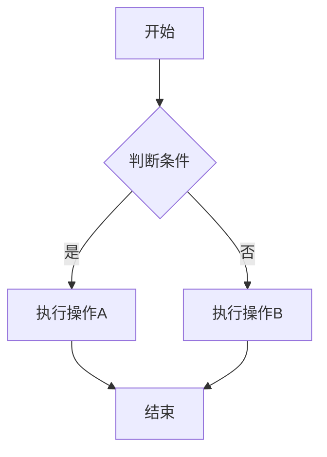
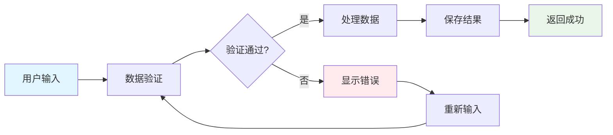
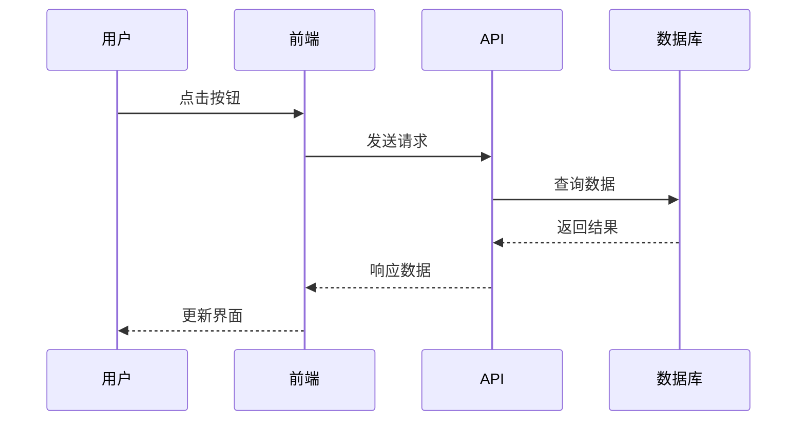
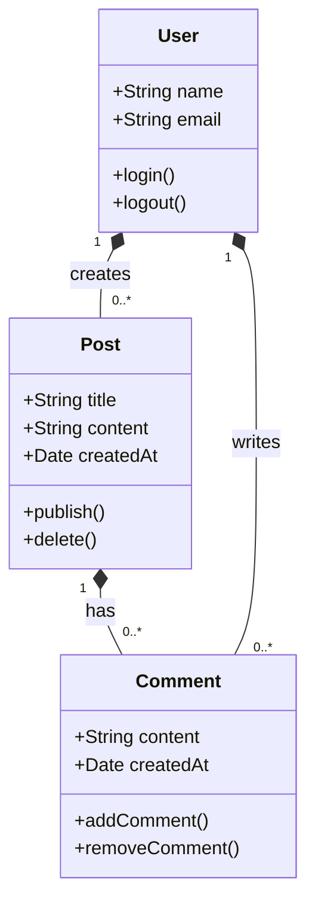
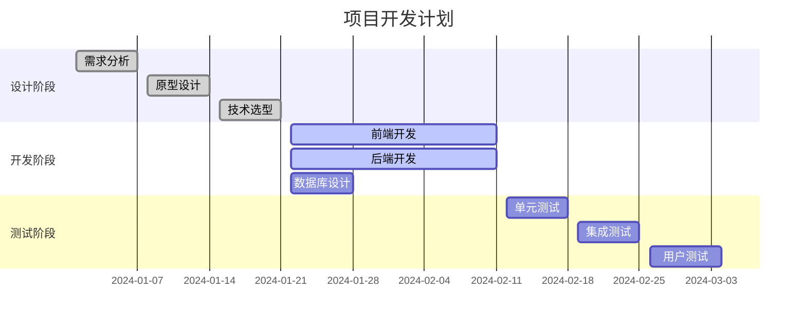
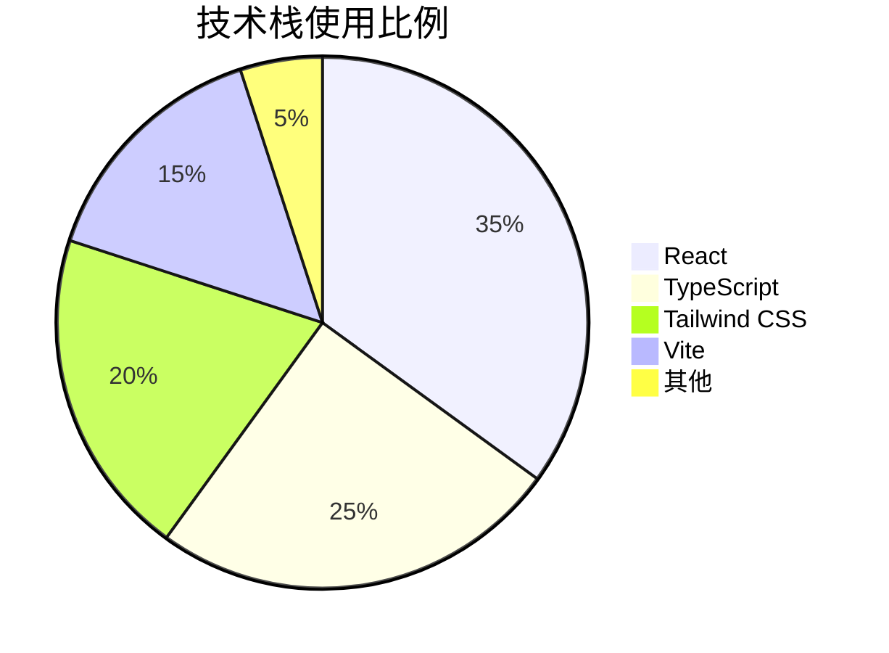
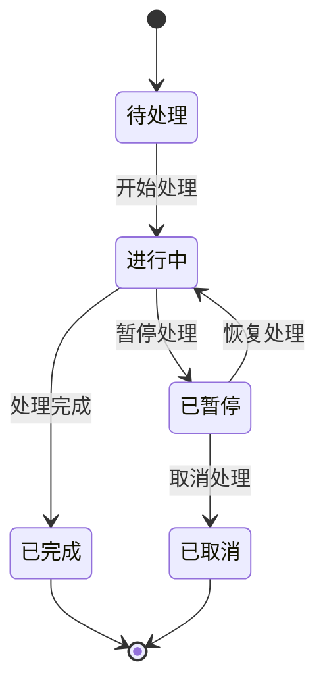
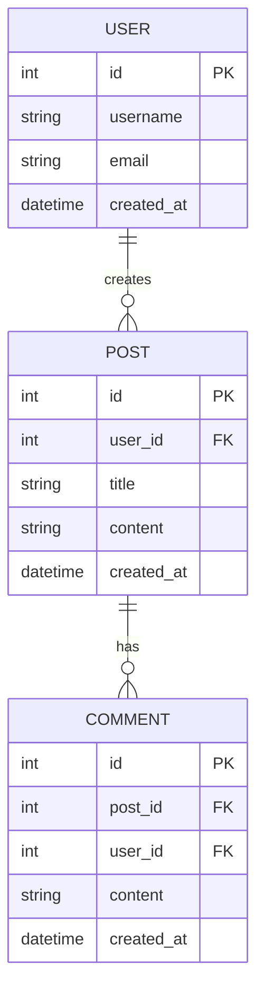
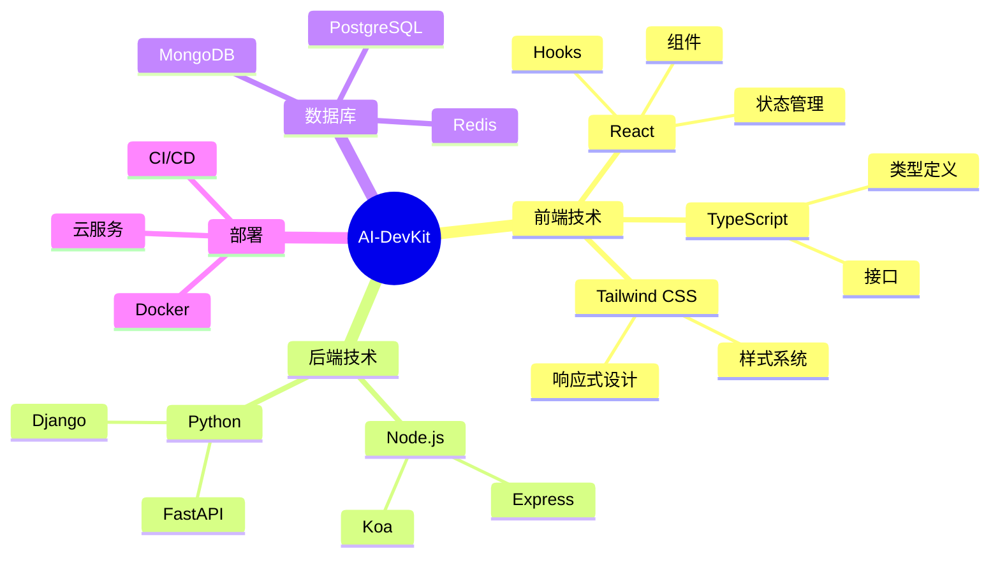
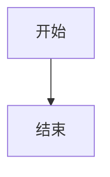

# Mermaid 图表示例

本页面展示了 VitePress 中 Mermaid 图表的各种类型和功能。

## 流程图 (Flowchart)

### 基础流程图



### 复杂流程图



## 时序图 (Sequence Diagram)



## 类图 (Class Diagram)



## 甘特图 (Gantt Chart)



## 饼图 (Pie Chart)



## 状态图 (State Diagram)



## 实体关系图 (ER Diagram)



## 思维导图 (Mind Map)



## 交互功能

所有图表都支持以下交互功能：

- **缩放**：使用鼠标滚轮或控制按钮进行缩放
- **拖拽**：点击并拖拽图表进行移动
- **全屏**：点击全屏按钮查看大图
- **代码查看**：点击代码按钮查看 Mermaid 源码
- **复制代码**：一键复制图表代码

## 使用说明

在 Markdown 文件中，使用以下语法创建 Mermaid 图表：

```markdown

```

支持的主题：
- 默认主题
- 暗色主题（自动适配）
- 自定义样式

## 最佳实践

1. **简洁明了**：图表应该简洁易懂，避免过于复杂
2. **颜色搭配**：使用合适的颜色来区分不同的元素
3. **标签清晰**：为节点和连接线添加清晰的标签
4. **响应式设计**：图表会自动适配不同屏幕尺寸
5. **性能优化**：大型图表建议使用懒加载 
