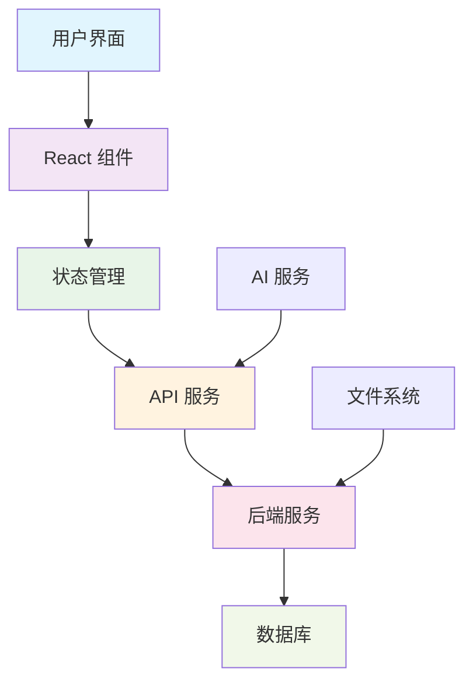

## 为什么选择 AI-DevKit？

AI-DevKit 是一个专为 AI 辅助编程设计的全栈项目模板，集成了 React、TypeScript、Tailwind CSS 等现代化技术栈。通过提供清晰的项目架构、标准化的开发规范和丰富的 AI 提示词模板，让开发者能够快速与 AI 协作，高效构建高质量的前端应用。无论是初学者还是经验丰富的开发者，都能基于此模板快速搭建项目骨架，专注于业务逻辑开发。

### 🎯 核心特性

- **快速启动**: 几分钟内创建完整的项目结构
- **现代化技术栈**: TypeScript + React + Vite + Tailwind CSS
- **AI 友好设计**: 专为 AI 辅助开发优化的代码结构
- **完整工具链**: 内置 CLI 工具、文档生成、代码检查等
- **最佳实践**: 内置安全、性能、可维护性的最佳实践

### 🚀 快速开始

```bash
# 克隆项目
git clone https://github.com/your-repo/ai-fast-project.git

# 安装依赖
npm install

# 启动开发服务器
npm run dev
```

### 🏗️ 系统架构



### 📖 文档导航

- [快速开始指南](/guide/getting-started) - 5分钟上手教程
- [系统架构](/guide/architecture) - 架构设计详解
- [集成方案](/guide/integration) - 第三方服务集成
- [React 学习中心](/react/learning) - React 从入门到精通 ⭐
- [提示词模板](/prompts/) - AI开发提示词集合

### 🤝 贡献

我们欢迎所有形式的贡献！无论是报告bug、提出新功能建议，还是提交代码，都非常欢迎。

查看我们的[贡献指南](https://github.com/your-repo/blob/main/CONTRIBUTING.md)了解更多信息。
