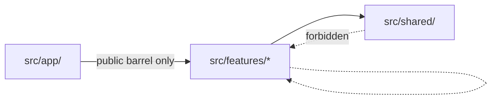

# Architecture: Feature-first React

This document explains **why** the EvoMap template uses a feature-first layout and **how** the architectural boundaries are enforced. It is reproduced (in shorter form, as a non-negotiable rule) in [packages/template-react/.agent/rules/00-architecture.md](../packages/template-react/.agent/rules/00-architecture.md); read that file too if you are an AI agent acting on the codebase.

> Looking for v1 (pre-monorepo) design notes — Providers tuning, performance work, Toast integration, service-layer architecture? They live under [./legacy/](./legacy/) as archived reference material. They do **not** describe the current v2 implementation.

## Motivation

Mainstream React tutorials still default to "type-first" layouts — `components/`, `hooks/`, `utils/`, `pages/` at the root, with files from many unrelated features mixed together. This works for tiny apps and breaks down predictably as the app grows:

- Code that conceptually belongs together is scattered across the tree by file kind.
- New contributors (and AI agents) have to read many directories to learn how one feature works.
- Tests live far from the code they test.
- Refactoring or deleting a feature is risky — files belonging to it are mixed with everything else.

**Feature-first** flips the layout: code is grouped first by the user-facing capability it serves, then by file kind inside that group.

## The layout

```
src/
├── app/                # Application shell: providers, router, layouts, shell pages
├── features/<name>/    # One directory per user-facing capability
├── shared/             # Cross-feature primitives (ui, lib, hooks, i18n, supabase, …)
└── styles/             # Tailwind v4 entry + global CSS
```

A typical feature looks like:

```
src/features/counter/
├── components/         # Components used only inside this feature
├── hooks/              # Feature-scoped use* hooks
├── stores/             # Zustand stores owned by this feature
├── services/           # API / data access (calls supabase, fetch, …)
├── pages/              # Route-level components
├── routes.tsx          # <Route> declarations (optional)
├── types.ts            # Feature-scoped TypeScript types
├── index.ts            # Public API barrel — the only file external code may import
└── __tests__/          # Tests mirroring the source layout
```

Subdirectories that aren't needed are simply omitted — no empty folders.

## The three boundaries



Three rules govern imports across this tree:

1. **A feature may not import another feature's internals.** Any access from feature `A` to feature `B` goes through `@/features/B` (i.e. `B/index.ts`).
2. **`src/shared/` must not depend on `src/features/`.** Shared code is leaf-level — it knows nothing about what feature uses it.
3. **`src/app/` may import a feature only through its public barrel** (`index.ts` or `routes.tsx`).

All three are enforced at lint time via `eslint-plugin-import`'s `import/no-restricted-paths` rule, configured in [packages/template-react/eslint.config.js](../packages/template-react/eslint.config.js). Violating one is a build break, not a stylistic warning.

## Why a public barrel?

Each feature's `index.ts` is its **contract** with the rest of the app. It is the only file outside the feature can see. This gives us three things for free:

1. **Refactoring safety.** Moving / renaming internals never breaks consumers as long as the barrel re-exports the same names.
2. **Explicit API surface.** Anything you don't intentionally export from `index.ts` is private — no one can accidentally depend on it.
3. **Greppability.** Finding all consumers of a feature is `rg "from '@/features/<name>'"` — there is exactly one path to search for.

The cost is one extra file per feature and the discipline of updating it. That cost is real but very small compared to the structural payoff.

## When to extract to `shared/` vs. create a new feature

Use this heuristic when introducing new code:

| Characteristic                                         | Goes in              |
| ------------------------------------------------------ | -------------------- |
| Has its own route, state, or data model                | New feature          |
| Presentational primitive (button, layout helper, hook) | `src/shared/`        |
| Cross-cutting concern (auth, analytics, theming)       | `src/shared/<area>/` |
| Genuinely one-off page in an existing capability       | Existing feature     |

**Bias toward creating features.** "Promote shared" later is easy; "split a feature back apart" is expensive. A single-page feature with one component, one route, and a few tests is perfectly fine.

## How the layout interacts with the rest of the stack

- **Routing.** Each feature exposes a `routes.tsx` whose JSX is composed into the app router in `src/app/router.tsx`. Routes are owned by the feature, not the app shell.
- **State.** Zustand stores live in `features/<name>/stores/`. The store is exported through the feature's barrel only if other features need it (which is rare and worth scrutiny — usually they don't).
- **Server state.** TanStack Query queries / mutations live in `features/<name>/services/` (the async function) and `features/<name>/hooks/` (the `useXQuery` wrapper). Both go through the barrel only when exported intentionally.
- **i18n.** Translation keys are namespaced by feature (`counter.title`, `home.cta`); see [rules/60-i18n.md](../packages/template-react/.agent/rules/60-i18n.md).
- **Tests.** Each feature owns its tests in `<feature>/__tests__/`, mirroring its source layout. Cross-cutting tests live at the repo root in `__tests__/`.

## Anti-patterns to avoid

- A `common/` or `core/` directory under `src/` that becomes the dumping ground for everything. (Use `src/shared/` instead and resist the urge to expand it.)
- Mocking imports relative to the feature internals in tests. Mock at the **service** boundary (or above) — that mirrors the import boundary rule.
- A "god" feature that owns half the app. If a feature's directory becomes hard to scan, split it. Two smaller features with explicit boundaries beat one large one almost always.
- "Just this once" imports from another feature's internals. The lint rule will not allow it, and the moment you bend the rule once you erode the contract.

## Migration notes

If you are migrating from a type-first layout, the recommended sequence:

1. Create empty `features/<name>/` directories.
2. Move route-level components in first; expose them via `routes.tsx` and `index.ts`.
3. Move stores, services, and hooks that are used by exactly one feature.
4. Repeat until `src/components/`, `src/hooks/`, `src/store/` are emptied or reduced to true cross-cutting primitives, which then move into `src/shared/`.
5. Turn on `import/no-restricted-paths`. Fix the remaining violations.
