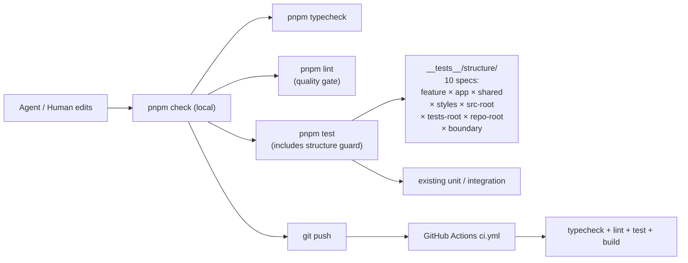

# Eikon-React Template Quality System

> Design doc for the two-layer **structural guard + AI-friendly lint** system
> shipped in `packages/template-react/`. Every scaffolded app inherits the
> entire stack via `create-eikon-react`.
>
> Audience: maintainers extending this stack, AI agents reasoning about
> why a rule fired, and reviewers approving changes that touch the
> shape of the template.

---

## Table of contents

1. [Why we don't reuse the standard "human" lint stack](#1-why-we-dont-reuse-the-standard-human-lint-stack)
2. [Two-layer model — structure guard + quality gate](#2-two-layer-model)
3. [Structure guard — every spec, every assertion](#3-structure-guard)
4. [Quality gate — every lint rule and its thresholds](#4-quality-gate)
5. [Local `eikon` ESLint plugin — internals](#5-local-eikon-eslint-plugin)
6. [`_helpers.ts` — why a hand-rolled RegExp mini-parser](#6-the-_helpersts-mini-parser)
7. [Scripts and CI](#7-scripts-and-ci)
8. [How new features / new shared areas / new locales pass automatically](#8-extending-the-template)
9. [Evolution strategy](#9-evolution-strategy)

---

## 1. Why we don't reuse the standard "human" lint stack

The default community recipe for a React/TypeScript project (Airbnb,
Standard, `eslint:recommended`, `unicorn/all`, etc.) is optimised for
**humans writing one feature at a time over many months**. The marginal
reader is a colleague who already has tribal knowledge of the codebase.

Our marginal reader is different. The eikon-react template is built
for **AI coding agents (Cursor, Claude Code, Codex, Copilot Workspace)
generating code from a fresh context window**. Their failure modes are
qualitatively different:

| Human failure mode | Agent failure mode |
|---|---|
| Inconsistent indentation | Reads only the top 50 lines, misses important context buried at line 500 |
| Forgetting null checks | Puts a new component in `src/utils/` because they couldn't find `src/features/` |
| Naming things `Helper2` | Names a file `tasksStore.ts` but exports `useStore` — making it ungreppable |
| Slightly stale docs | Trusts the file-header `@description` literally; bad description = wrong context = wrong code |
| Bikeshedding default-vs-named export | Silences any rule that fires because suppressing the symptom is cheaper than fixing the cause |

The implication: we keep what works for humans (`@typescript-eslint/recommended`,
`react-hooks`, prettier-friendly formatting) AND add a layer that
specifically targets agent-failure modes — banner, filename ↔ export
linkage, per-directory casing, file size cap, named-export-only.

We also recognise that agents will silence ESLint rules they don't
understand. So the most load-bearing structural invariants live in
**tests** (where suppression = an obvious diff) rather than lint.

---

## 2. Two-layer model



### Decision tree — which layer does a new rule belong in?

```
Is the rule about a single file, in isolation?
  ├─ YES, and a clear fix exists per-message → LINT (eikon/* or built-in)
  └─ NO  ↓

Does the rule reason about multiple files / whole directories?
  ├─ YES → TEST (structure guard)
  └─ NO  ↓

Would silencing the rule defeat its purpose (e.g. boundary checks)?
  ├─ YES → TEST (so suppression shows up in code review)
  └─ NO  → LINT (so the developer can iterate quickly)
```

When in doubt, start in the **test** layer. Promoting a structure test
to a lint rule later is cheap; demoting a lint rule that fires too
often is much harder because everyone already started suppressing it.

---

## 3. Structure guard

10 specs under [`packages/template-react/__tests__/structure/`](../packages/template-react/__tests__/structure/),
all sharing the same plumbing in
[`_helpers.ts`](../packages/template-react/__tests__/structure/_helpers.ts).

> **Why no `.agent/` spec?** The `.agent/` tree is the agent's own
> meta-protocol surface — rules they author, skills they iterate on,
> README they curate. Gating it with structure tests creates friction
> in the layer we explicitly want the agent to feel free to mutate.
> The conventions in `.agent/README.md` are guidance, not a gate.

### A. Feature layer (3 specs)

#### `feature-shape.test.ts`

Iterates `src/features/*`. For each feature, detects shape (`services/`
present ⇒ data-layer) and asserts:

- **Both shapes**: `index.ts`, `routes.tsx`, `pages/` present.
- **Both shapes**: only allowlisted top-level entries (components/, hooks/,
  i18n/, pages/, selectors/, services/, store/, stores/, __tests__/, plus
  the three allowed files `index.ts`/`routes.tsx`/`types.ts`).
- **Data-layer extras**: `types.ts`, `store/<feature>Store.ts`,
  `selectors/{basic,computed,actions,index}.ts`,
  `services/{<f>Service.ts, factory/<f>ServiceFactory.ts, interfaces/I<F>Service.ts}`,
  and at least one `services/implementations/<X><F>Service.ts`.
- **Pure-client invariant**: must NOT have `services/`, `store/`,
  `selectors/` — those are the signals for the other shape.

**Failure means**: the agent built half a data-layer feature. The
service factory, the store, or the selectors barrel is missing —
runtime imports will fail.

#### `feature-public-api.test.ts`

Parses each feature's `index.ts` with the helper's mini-parser. Asserts:

- Always exports `<feature>Routes`.
- Data-layer features also export `<feature>Store`, `<feature>Service`,
  at least one `use*Actions` hook.
- No re-exports from private subpaths — only the allowlisted patterns
  (`./routes`, `./types`, `./selectors`, `./services/<f>Service`,
  `./store/<f>Store`) are tolerated.

**Failure means**: the barrel grew a leak. The next feature touching
this one will inherit the leak by following the pattern.

#### `feature-i18n-parity.test.ts`

For every feature with `i18n/`:

- en.json and zh.json both present.
- Their flattened key sets (deep dotted-path enumeration) are identical.
- Every key segment is camelCase.

Plus `shared/i18n/locales/<lng>/common.json` parity across all locales.

Wrapped in `if (featureEnabled('i18n')) { ... }` so a CLI `--no-i18n`
project still passes (the entire `shared/i18n/` tree is gone in that
case).

**Failure means**: at least one language renders a literal key string
to the user.

### B. App shell

#### `app-shell.test.ts`

- `src/app/` has `providers.tsx`, `router.tsx`, `layouts/RootLayout.tsx`.
- `layouts/` has ≥ 1 sibling `*RootLayout.tsx` (a layout variant), and
  the dispatcher actually imports at least one of them — catches a
  half-applied CLI strip or a manual variant removal that breaks the
  array entries in the dispatcher.
- `app/pages/` (if present) only PascalCase `.tsx`.
- `app/` does NOT contain feature-flavoured subdirs (`services/`,
  `store/`, etc.) — those should be feature-private.

### C. Shared layer

#### `shared-shape.test.ts`

The single biggest dumping-ground risk in the codebase. We hard-code
the allowed shape:

- Top-level whitelist: `ui/`, `lib/`, `hooks/`, `stores/`, `theme/`,
  `i18n/`, `services/`, `supabase/`.
- Barrel-required areas: `theme/`, `i18n/`, `services/`, `supabase/`
  (each must have `index.ts`).
- Per-area shape:
  - `ui/` → kebab-case `.tsx` only (shadcn convention).
  - `lib/`, `hooks/`, `stores/`, `theme/` → camelCase `.ts`.
  - `hooks/` filenames must start with `use`.
  - `theme/` → barrel re-exports `useThemeStore`.
  - `i18n/` → barrel exports `loadNamespace`; locales have parallel
    namespace sets across all languages.
  - `services/` → barrel exports `serviceConfig`; `config/serviceConfig.ts`
    must exist.
  - `supabase/` → `index.ts` + `client.ts`, BOTH starting with `// @eikon:feature(supabase) file`.

### D. Styles

#### `styles-shape.test.ts`

- Exactly one `.css` file in the project: `src/styles/index.css`.
- Contains `@import 'tailwindcss'` and `@theme`.
- No `tailwind.config.{js,ts,cjs,mjs}` at the project root (would
  shadow the CSS-first `@theme` source of truth).

### E. `src/` root

#### `src-root.test.ts`

- Only files: `main.tsx`, `App.tsx`, `vite-env.d.ts`.
- Only directories: `app/`, `features/`, `shared/`, `styles/`.
- `main.tsx` side-effect-imports `@/styles/index.css`.

### F. Top-level `__tests__/`

#### `tests-root.test.ts`

- Required files: `setup.ts`, `test-utils.tsx`.
- Required directories: `structure/`, `app/`, `integration/`, `eslint-rules/`.
- No loose `*.test.ts(x)` at the top of `__tests__/` — every spec must
  belong to a sub-folder so the organisational signal stays clean.

### G. Repo-root configs

#### `repo-root-files.test.ts`

- Hard list of files that must exist at the project root: `package.json`,
  `tsconfig.{json,app.json,node.json}`, `vite.config.ts`,
  `vitest.config.ts`, `vitest.browser.config.ts`, `eslint.config.js`,
  `.prettierrc.json`, `index.html`, `README.md`, `LICENSE`,
  `.env.example`, `.gitignore`, `.github/workflows/ci.yml`,
  `.agent/README.md`, `eslint-rules/index.js`.
- `package.json` has every script the CI workflow assumes: `dev`,
  `build`, `lint`, `lint:fix`, `typecheck`, `test`, `test:structure`,
  `check`, `ci`.
- `engines.node` and `packageManager` set (CI cache key relies on the
  packageManager value).

### H. Boundary imports (cross-layer)

#### `boundary-imports.test.ts`

The same 5 rules `eslint-plugin-import` enforces, restated as a test
sweep:

1. `src/features/A/**` cannot import `@/features/B/<deep>` — barrel only.
2. `src/shared/**` cannot import from `@/features/**` at all.
3. `src/app/**` can only import features via barrel or `routes`.
4. Feature internals cannot import `@/shared/<barrel-required>/<deep>` —
   must use the barrel. (Barrel-required areas: `theme/`, `i18n/`,
   `services/`, `supabase/`.)
5. `src/styles/**` cannot be imported except by `src/main.tsx`.

**Why we duplicate ESLint's work**: agents silence lint rules. Deleting
a test is much louder in PR review.

---

## 4. Quality gate

All rules live in [`eslint.config.js`](../packages/template-react/eslint.config.js).
The plugin layer is split into three:

1. **Recommended sets**: `@eslint/js`, `typescript-eslint`,
   `eslint-plugin-react` (recommended + jsx-runtime),
   `eslint-plugin-react-hooks`, `eslint-plugin-react-refresh`,
   `eslint-config-prettier`. Standard fare — kept as-is.
2. **Local `eikon` plugin**: project-specific AI-friendliness rules
   (3 rules, zero npm deps; see §5).
3. **Built-in ESLint rules** at AI-friendly thresholds.

### 4.1 Rules and thresholds

| Rule | Setting | Why |
|---|---|---|
| `eikon/file-header-banner` | error, `minDescription: 10` | Banner is the first thing the agent reads when opening a file. 10 chars is "two short words", enough to differentiate two files but small enough to not punish tiny barrels. |
| `eikon/filename-matches-export` | error | Direct grep-ability. See §5 for the candidate-set matching algorithm. |
| `eikon/filename-case-by-path` | error, ordered glob table | Per-directory casing (PascalCase / camelCase / kebab-case) — the template intentionally mixes conventions per folder type. |
| `max-lines` | error, **400** lines (source) / **600** (tests), skip blanks & comments | 400 ≈ what fits in a single agent read without truncation while still allowing the v1 banner + section separators + per-export JSDoc. Tests get more room because arrange/act/assert blocks multiply. |
| `import/no-default-export` | error, with framework exception list | Default exports break grep ("which file exports `useFoo`?") and refactor tools. Exceptions: `main.tsx`, `App.tsx`, every `*.config.{js,ts,mjs,cjs}`. |
| `import/order` | error, `always-and-inside-groups` | Preserves the v1 banner subgrouping (Core / Core-related / Third-party / Absolute / Relative). |
| `import/no-restricted-paths` | error | Same boundary contract `boundary-imports.test.ts` enforces. |

### 4.2 Why **400 lines** specifically

A few data points:

- GPT-4-class models reliably attend to ~8K tokens of code in a single
  response without losing thread; 400 lines × ~50 chars/line × ~0.25
  tokens/char ≈ 5K tokens, well inside the comfort zone.
- Claude / GPT-5 / Gemini are happy up to 1K-2K lines but human PR
  reviewers degrade fast past ~300. The cap acknowledges both audiences.
- 600 for tests is calibrated to the existing `tasksStore.test.ts` /
  `MockTasksService.test.ts` which hover around 350–500 lines when
  fully exhaustive.
- If a file legitimately needs > 400 lines (e.g. a generated parser
  table), prefer `// eslint-disable max-lines` with a comment over
  raising the global threshold.

### 4.3 Why no `eslint-plugin-jsdoc`

`eslint-plugin-jsdoc` overlaps with `eikon/file-header-banner` (the
`require-file-overview` rule) but doesn't enforce description body
length or position-before-code. We'd end up with two overlapping
rules, the agent confused about which suppression silences which one,
and a npm dependency on a 200-rule plugin for one of its rules.

The local plugin handles it with 100 lines of code, zero deps, and a
narrower contract.

---

## 5. Local `eikon` ESLint plugin

Lives in [`packages/template-react/eslint-rules/`](../packages/template-react/eslint-rules/),
loaded by `eslint.config.js` via a relative import. Zero npm dependencies.

### `file-header-banner`

- Find the **first JSDoc block comment** (block comment starting with
  `*`). Leading line comments (`// @eikon:feature(supabase) file`) are
  tolerated — the banner can appear after them.
- The banner MUST come before any program body node.
- The banner text MUST contain `@file` and `@description`.
- The `@description` body MUST have ≥ `minDescription` (default 10)
  visible characters after collapsing JSDoc `*` markers and whitespace.

### `filename-matches-export`

Walks the program body, collects all exported identifier names from
`ExportNamedDeclaration` (with declaration AND with specifiers) and
`ExportDefaultDeclaration`. Compares against this candidate set for
the basename `b`:

```
{
  b,
  pascalCase(b),
  camelCase(b),
  'use' + pascalCase(b),
  'I'   + pascalCase(b),
}
```

If at least one export matches at least one candidate, pass. Skipped
basenames (zero check): `index`, `routes`, `types`, `main`, `setup`,
`test-utils`, `mockData`, `client`, `vite-env.d`, `providers`,
`router`. Skipped suffix patterns: `*.test.*`, `*.spec.*`, `*.config.*`,
`*.d.ts`. Files with zero exports also pass (nothing to compare).

Why these five candidates: they cover every naming pattern in the
template (PascalCase components, camelCase utilities, `use<X>Store`
hook stores, `<x>Store` vanilla stores, `I<X>Service` interfaces,
`<X>Service` class implementations) without needing per-folder
overrides.

### `filename-case-by-path`

Takes an ordered list of `{ glob, case, skip? }` rules. The first
matching glob wins; the basename (stripped of `.test`/`.spec`/`.d`
plus the final extension) is checked against the case via
`detectCase()`.

Glob support is minimal (`*`, `**`, `?`, `{a,b}`) via a hand-rolled
matcher in [`lib/glob-match.js`](../packages/template-react/eslint-rules/lib/glob-match.js).
Detector is in [`lib/case.js`](../packages/template-react/eslint-rules/lib/case.js).

---

## 6. The `_helpers.ts` mini-parser

Why we don't use a real AST (`@babel/parser`, `@typescript-eslint/parser`)
inside the structure tests:

- The structure tests should run in **single-digit seconds** so the
  inner-loop `pnpm test:structure` stays cheap.
- Loading a full TS parser per file would add ~50–100 ms × hundreds of
  files = visible perf regression.
- The structural assertions only need three things: exported identifier
  names, imported source strings, and JSON key flattening. RegExp on
  comment-stripped source gives us all three with ~80 lines of code.

What we accept in exchange:

- **String-literal false positives**: an `export { Foo }` written
  inside a string literal would be picked up. We tolerate this because
  the template doesn't do that, and the failure mode is "too strict"
  not "too lax" (a fake export would be expected, then absent → test
  fails noisily).
- **Comment edge cases**: a `/* ... */` containing `*/` inside a
  string would mis-strip. Same answer.

If these become real problems, swap `parseExportNames` / `parseImportSources`
for `@typescript-eslint/parser`. The helper interface stays the same.

---

## 7. Scripts and CI

### `package.json` scripts table

| Script | What it runs | When |
|---|---|---|
| `pnpm dev` | `vite` | Development |
| `pnpm test` | `vitest run` (includes structure) | Watch loop / CI |
| `pnpm test:watch` | `vitest` | Inner loop |
| `pnpm test:structure` | `vitest run __tests__/structure` | Fast feedback on layout change |
| `pnpm test:coverage` | `vitest run --coverage` | Coverage report |
| `pnpm test:browser` | `vitest run --config vitest.browser.config.ts` | Opt-in browser-mode E2E |
| `pnpm typecheck` | `tsc -b --noEmit` | CI / pre-commit |
| `pnpm lint` | `eslint . --max-warnings 0` | CI / pre-commit |
| `pnpm lint:fix` | `eslint . --fix` | Inner loop |
| `pnpm check` | typecheck → lint → test | Local pre-push |
| `pnpm ci` | typecheck → lint → test → build | What CI invokes |
| `pnpm build` | `vite build` | Release |
| `pnpm build:check` | `tsc -b && vite build` | Stricter pre-release |

### GitHub workflow

[`.github/workflows/ci.yml`](../packages/template-react/.github/workflows/ci.yml)
runs `quality` on push to `main` and on every PR. Single job, ordered
steps (cheap to expensive): typecheck → lint → test → build. Concurrency
group cancels in-flight runs for the same ref.

Browser-mode E2E is commented-out behind a `if: false` guard because
it needs a one-time ~120 MB Chromium install — opt-in per project.

Because the workflow file lives at `packages/template-react/.github/`
inside this monorepo, GitHub Actions does NOT trigger it for the
eikon-react repo (Actions only reads from the repo-root `.github/`).
The file IS in scope when a user scaffolds an app via
`create-eikon-react` — the scaffold becomes the workflow's repo root
and it runs immediately.

---

## 8. Extending the template

### New feature

`add-feature` skill takes care of it. The feature-shape /
feature-public-api / feature-i18n-parity tests automatically cover the
new feature by iterating `src/features/*`. The eikon lint rules
automatically apply.

### New shared area (e.g. `shared/analytics/`)

1. Decide if it's barrel-required (coherent module) or flat collection.
2. Update `ALLOWED_SHARED_DIRS` in
   [`shared-shape.test.ts`](../packages/template-react/__tests__/structure/shared-shape.test.ts).
3. Update `BARREL_REQUIRED_DIRS` in the same file if barrel-required.
4. Update `BARREL_REQUIRED_SHARED_AREAS` in
   [`boundary-imports.test.ts`](../packages/template-react/__tests__/structure/boundary-imports.test.ts).
5. Add appropriate `FILENAME_CASE_RULES` entry to `eslint.config.js`.
6. Document the why in the PR description.

### New locale

`add-locale` skill takes care of it. The shared-shape /
feature-i18n-parity tests automatically check the new locale shares
the same namespace set and key set as the existing ones.

### New `.agent/` rule or skill

`.agent/` is intentionally unguarded — it's the agent's own meta-protocol
surface. Follow the conventions documented in `.agent/README.md`
(numeric-prefix rule filenames, YAML frontmatter with `id` / `title` /
`description` / `severity`) as guidance. If we ever discover a class of
.agent drift that's hurting Agents in practice, we'll add a guard
then — until that data exists, friction here is pure tax.

---

## 9. Evolution strategy

### When to relax a threshold

If a rule fires N times in a single sprint with N > 5 and every fix
was "the rule was wrong here", the threshold needs to move. Convert
the false-positives into explicit allowlist entries in the rule config
first; if the allowlist itself grows past ~10 entries, that's the
signal to revisit the threshold itself.

### When to promote a structure test into lint

If a structure-test failure consistently triggers the same single-file
fix (no architectural reasoning required), and we'd rather have it as
inline `eslint-disable`-able friction during typing, promote.

Example trajectory we anticipate: today `tests-root.test.ts` rejects
loose specs. If we ever want loose specs in `__tests__/<unknown>/`
during a refactor, the right move is to convert it to a lint rule with
a temporary inline disable instead of deleting the assertion.

### When to demote a lint rule into a structure test

If an agent is found to be silencing a lint rule via `/* eslint-disable */`
in production PRs, that's the signal to move it to the test layer.
The friction goes up, but the suppression friction becomes visible in
review.

### Versioning

The `eikon` plugin version (`eslint-rules/index.js`) is unrelated to
the template version. We bump it when we break a rule's
default-message-id contract (which would silently mark previous
suppressions stale). Tag it in a commit message footer:
`Updates eikon plugin from 1.0.0 to 2.0.0`.

---

## Appendix — file map

```
packages/template-react/
├── .agent/rules/80-quality-system.md      ← Agent-facing summary
├── .github/workflows/ci.yml               ← The CI gate
├── eslint.config.js                       ← Lint rule wiring
├── eslint-rules/
│   ├── index.js                           ← Plugin entry
│   ├── lib/
│   │   ├── case.js                        ← Case detectors / converters
│   │   └── glob-match.js                  ← Hand-rolled glob matcher
│   └── rules/
│       ├── file-header-banner.js
│       ├── filename-case-by-path.js
│       └── filename-matches-export.js
├── __tests__/
│   ├── eslint-rules/
│   │   ├── helpers.test.ts                ← Tests for glob/case helpers
│   │   └── rules.test.ts                  ← Smoke tests per rule
│   └── structure/
│       ├── _helpers.ts                    ← Shared scanning utilities
│       ├── feature-shape.test.ts          ← A. Feature directory shape
│       ├── feature-public-api.test.ts     ← A. Barrel exports
│       ├── feature-i18n-parity.test.ts    ← A. en/zh key equality
│       ├── app-shell.test.ts              ← B. App shell wiring
│       ├── shared-shape.test.ts           ← C. Shared subdirs
│       ├── styles-shape.test.ts           ← D. Tailwind v4 entry
│       ├── src-root.test.ts               ← E. src/ root layout
│       ├── tests-root.test.ts             ← F. __tests__/ root layout
│       ├── repo-root-files.test.ts        ← G. Repo-root configs
│       └── boundary-imports.test.ts       ← H. Cross-layer imports
└── package.json                           ← Scripts: check / ci / test:structure
```
